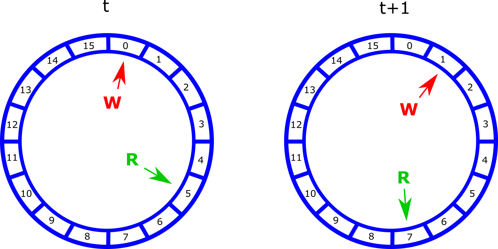
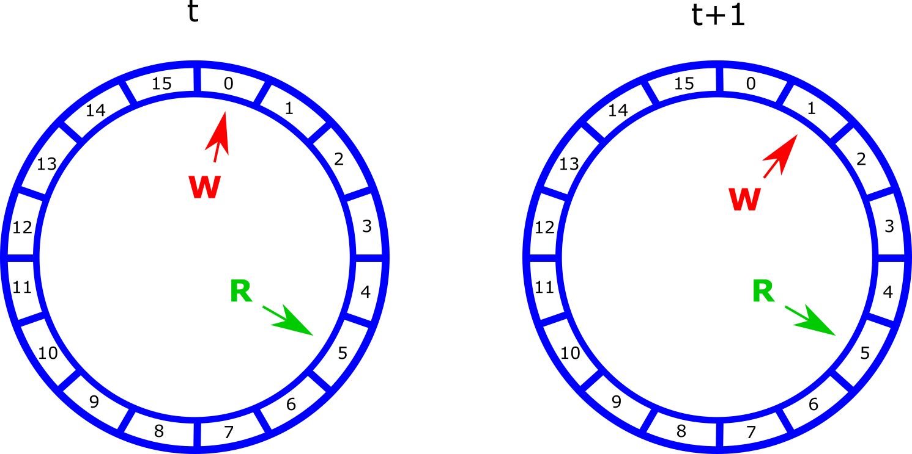

# Introduction

We designed a real-time pitch shifter on the DE1-SoC FPGA that was controlled by the ARM core using a GUI. The motivation for this project stemmed from the fact that the large amount of processing power available on the FPGA is well suited to audio input and output streaming, along with the required intermediate processing. As a result, we decided to utilize these capabilities to design and implement a real-time pitch shifter that could perform the following tasks: pitch-shift the left and right audio outputs independently with manual pitch tuning, produce voice chords using the right and left audio outputs along with the original voice, and produce time-variant pitch shifting by modulating the appropriate parameters at varying rates. The final product is able to produce many different voice effects, all while being controlled from a simple, user-friendly GUI displayed on a VGA monitor.

Figure 1: Project Setup with speackers, mouse, microphone, and FPGA

## High Level Design

We decided to pursue this project idea after seeing the audio output capabilities from lab 3, as well as a desire to have a fun project with an interesting demo. The only background math required for this project was simple arithmetic and some basic digital signal processing knowledge. We used a 6th order Butterworth filter to smooth out high frequency noise from our system. This was in essence a low pass filter that attenuated signals above 3500 Hz while leaving signals at lower frequencies mostly unchanged. We also used fixed point arithmetic extensively in this project, as it allowed us plenty of accuracy for our sound samples, while leaving the arithmetic easy to implement (as opposed to using a floating point data type). The logical structure of this project revolved around modifying settings for our audio processing modules using the GUI running on the HPS, then speaking/playing music into the microphone that fed into the FPGA, where it ran through our buffer modules to change the pitch then through our filter module to smooth out any high frequency noise that may have been added to the system by this pitch shifting, and then back out through speakers. Our structure allowed us to play two different pitch shifted signals through the different speakers, taking advantage of the stereo output capability of the development board we used (DE1). By using the FPGA, we were able to process multiple streams of audio input simultaneously at a high sample rate (96 KHz), something we would probably not be able to do on the HPS alone. It also made sense to us to write the User Interface (UI) on the HPS, as there were linux drivers in place to take care of using a mouse as a HID, so we could use it to interact with a screen we created that was displayed on the VGA, using code from previous labs in this course. We did not use any standards (IEEE, ISO, ANSI, etc) that we were aware of. We know that commercial pitch shifters exist, like the ones that are used in commercial autotuning and music production software. We wanted to create our own version to try a different approach from what we were able to glean from how these programs/tools worked, typically using calculation intensive FFT algorithms and the like.

Figure 2: Screenshot of QSys setup

## Hardware Development

### Pitch-Shifter

#### Design

Pitch shifting was implemented using two circular buffer structures. Upon receiving a new sample from the audio input microphone line, we performed two main tasks on each buffer. First, we write the new sample to the buffer using the current write address index. We then increment the write index by one entry. Second, we read a new audio sample from the buffer using the current read address index. We then increment the read address based on the pitch-shift, using a value we call “delta.” The actual read index used for the buffer is simply the integer portion of the incremented read address, which results in delta < 1 corresponding to a down-shift of the pitch (i.e., the audio samples are repeatedly read out). Similarly, delta > 1 corresponds to an up-shift of the pitch (e.g., some audio samples are skipped entirely in order to move to the next sample). This is due to the effective change in sampling rate that results from either skipping or repeating samples, causing a pitch-shift effect of the voice input.

Figures 3 and 4 illustrate the buffer actions that result from a newly obtained audio input sample for delta=2 and delta=0.5, respectively, by depicting the starting and final states of the read address “R” and write address “W” over two successive time steps. Note that Figures 3 and 4 illustrate the case of circular buffers of size 16. Our final pitch shifter design consisted of buffers of size 1024. This was determined to be the optimal size, based on our MATLAB simulations, for which discontinuity artifacts (discussed later) were minimized, while maximizing the cohesiveness of the audio output sound.

Figure 3: Circular buffer update for delta=2

Figure 4: Circular buffer update for delta=0.5

When shifting the voice pitch up (i.e., delta > 1), it is unavoidable that audio samples are read out at a higher rate than new samples are written into the buffer. As a result, the read index will surpass the available audio samples, running into “old” samples that remain from previous, outdated writes to the buffer space. This occurrence results in a noticeable “clicking” sound and other similar noise artifacts that arise from the discontinuity between current and old audio sample sequences.

To resolve these noise artifacts, we use a dual-buffer design. The key idea is to offset the write index for the second buffer by one half of the total buffer size. This results in the second circular buffer corresponding to a 180 degree shifted version of the original circular buffer. We then take the average of the two values read out from the buffers (note that the two buffers always have the same read index), which produces a smoothing effect that reduces the amount of clicking and other noise artifacts due to the wrap-around of the buffer reads. This method was also extensively simulated in MATLAB before being implemented and tested in hardware. Although the initial use of the circular buffer method was independently designed, the idea for the 180 degree phase shifted second buffer was adapted from [5].

A simplified state diagram of the described circular buffer module actions can be found in Figure 5. It is worth noting that an output valid signal for each buffer is raised while in state S2, which facilitates synchronization with the EBAB Wrapper module (described in a following section).

Figure 5: Circular buffer module state machine

#### Testing

Testing was done by creating a separate verilog module containing all aspects of the dual-buffer design and then simulating this design in ModelSim using a counter to represent the input audio samples. As a result, by changing the value of delta, we could then simply check the successive values of the audio output samples from the buffer module to confirm that the appropriate counts were being skipped over or repeated, depending on if the pitch was to be increased or decreased. Additionally, the proper state machine function was confirmed by stepping through the buffer update process to ensure all appropriate actions were being performed at the correct time.

Figure 6: Waves screenshot of buffer test

### Filter

#### Design

We used a 6th order Butterworth filter on the output from the circular buffers in order to smooth the high frequency noise from the signal. We modified code from the [DSP for DE2 page](https://people.ece.cornell.edu/land/courses/ece5760/DE2/fpgaDSP.html), using the given matlab scripts to generate the necessary constants for the desired filters. We changed the accuracy from 18-bit fixed point (2.16) to 32-bit fixed point (2.30) to give us better accuracy as well as to conform to the 32-bit width of our samples throughout the rest of the project. We also changed the incoming signal, dividing it by 2 (arithmetically shifting right by one), so that we would not have any overflow when we did the necessary multiply and accumulate needed by the Butterworth filter. By dividing by 2, we reduce the magnitude of the incoming signals to a range of [0,2) from [0,4), and since there is a multiplication, the range of outputs from the multiplier is [0,4), which fits in the 2.30 representation. We set the cutoff frequency to 3500 Hz, as we estimated this to be near the top of the range of human voice, so any high frequency noise at a higher frequency than this should be attenuated as much as possible.

#### Testing

The initial testing was done in Matlab, trying different filters on the outputs from the Matlab version of our buffer technique. Once we settled on a 6th order Butterworth filter, we began our hardware design and testing. The testing for the filter module was done mostly through ModelSim. We instantiated a filter module with constants determined by our Matlab program (SEE CODE). In the initial round of testing, we just ran a sine wave at various frequencies through the filter to see how it was affected on the output. This was done using Direct Digital Synthesis and a sine wave lookup table. Initially, we ran into overflow issues with the filter, leading to our decision to arithmetically right shift the input sample by 1, effectively preventing any further overflow, even on a high frequency square wave of maximum magnitude. When we were convinced the filter was working in ModelSim, we put the code in with our working buffers on the DE1 board. We then performed some usage testing to insure that there was no further overflow problems. This was done by providing large impulses to the microphone.

Figure 7: Waves screenshot of Butterworth-filter test

### EBAB Wrapper

The EBAB wrapper was used to encapsulate the processing of our design. This module was instantiated in the DE1_SoC_Computer top-level module. The are two sets of inputs/outputs, one from from audio system and the other from the HPS. Making this its own module allows for all the calculation to be simulated and tested without programming the board.

Figure 8: Block diagram of EBAB Wrapepr

#### Design

The EBAB wrapper instantiates a circular buffer and filter for each audio channel as seen in Figure 8. The inputs to each of these modules are data/valid pairs. Since audio samples are coming in at 96 kHz and the FPGA is clocked at 50 MHz, each output sample is computed much faster than a new output sample. For this reason we simplified from a full valid/ready latency insensitive interface to just data/valid pairs. Incoming read data is stored in each circular buffer whose output is connected to a Butterworth filter. The output from the filter is ready to be written to the audio out fifo.

Figure 9: EBAB State Machine

The state machine in Figure 9 shows when data comes in and out of the wrapper. The code was adapted from the audio-loopback example on the DSP page of the [course website](https://people.ece.cornell.edu/land/courses/ece5760/DE1_SOC/HPS_peripherials/DSP_index.html). The state machine starts by writing stereo to the audio FIFO and then reads new data from the audio FIFO. The first step is to read from the audio FIFO address to see if any space is available. Is there is enough space for both sample (left and right channel), the state machine proceeds to write each sample one at a time. If there is not enough space available, the state machine checks again. In practice the audio fifo was found to have enough space since we were writing at approximately the sample rate. After the writes are finished the state machine reads the audio FIFO address the check for available reads. If there is at least one sample available it reads from both channels. For the purpose of this lab, we only used the right audio input. When the right audio input was read we assert a valid signal for one cycle which kicks off the computation of a new sample. The state machine then returns back to the beginning.

#### Testing

Being able to simulate the wrapper was beneficial to our testing. Our testbench was able to generate clock and reset signals which stimulating the wrapper and responding outputs. Streaming in and out a counter made the outputs simple enough to verify while also making sure all the modules were connected properly. Initially, the wrapper only streamed in and out data from the bus. The encapsulation provided by this module allowed us to iteratively test integration and functionality. After the wrapper was tested in isolation the buffer was instantiated inside the wrapper so both could be tested together. The buffer was also tested in isolation before integration. These steps were completed while the filter was still in development allowing time to also test the wrapper on the board. The results after this test confirmed our MATLAB simulations as we were able to pitch shift but still needed filtering to reduce the high frequencies from the discontinuities in the output wave. Finally the filter was added into the wrapper after bugs in the wrapper and buffer had already been solved and the filter was testing in isolation. At this point we stopped testing in ModelSim and tested on the hardware.

## Software Development

 
Figure 10: GUI control on VGA monitor

### Design

The HPS program for this project functioned as a driver for the hardware modules we designed. The program controlled certain parameters related to different functionalities of the modules instantiated in the FPGA fabric. The communication was done largely through parallel input ports that looked like memory to the HPS program. We also used the HPS program to write directly to a VGA screen to provide a user interface for our pitch shifter. Also, the HPS program allowed the use of a mouse to set the various values, while interacting with the VGA screen through buttons and sliders we created. The main body of the program revolved around the mouse input, waiting for a left click event to occur. We had drawn preliminary structures on the screen to represent buttons and sliders, as well as placing text on the screen to guide the user. When a user would click on a button, the program would change some parameter and possibly update the screen, as in the case of moving a slider bar or changing the mode of one of the output channels. This was all done through multiple variables keeping track of the current state of the VGA screen and recognizing where the mouse was clicked on the screen.

### Testing

The entirety of the testing done for the HPS program was done through usage testing, as it was a user interface primarily. We tested the transfer of information between the HPS and the fabric through a few dedicated hard-coded values. Following this, we began building the UI by first defining where the different buttons and sliders would be on the screen, and placing print statements into the code to give an indication that we were clicking in the correct areas. Much of the rest of the testing was done this way: build a new part of the interface, then insert debugging print statements to prove to ourselves that it was functioning how we expected, then move on.

## Results

The following figures depict the achieved pitch-shifting in MATLAB simulations using a sine wave input. Additionally, Figure 11 illustrates the occurrence of a discontinuity artifact as well as the smoothing performed by the median and butterworth filters.

 
Figure 11: On the left the shifted output shows the discontinuities resulting from the averaging the circular buffers. On the right we tested different filters and combinations resulting in our choice to use a Butterworth filter

Finally, the video below contains a demo of the real-time pitch shifting effects performed by the final hardware design.

[video on YouTube](https://youtu.be/VeT4ikeRbic)

## Conclusion

Overall, this was a successful final project as we were able to implement real-time voice pitch shifting along with several other voice effects. Most importantly, the design we use is extremely simple and efficient in terms of the hardware implementation. One thing to note is that our method for pitch-shifting the voice input is a time-domain solution as opposed to the more common frequency-domain solutions that are found online. In terms of future work, it might be interesting to complete a frequency-domain pitch-shift method as well and compare the final results to our current design, evaluating the pros and cons of each method. However, we are satisfied with our design since it achieves all of the capabilities we had planned for at the outset of the project, and we were able to fully complete and test all aspects in the short project timeline.

In terms of other considerations for this project, we do not foresee any legal or IP issues since nearly all of our project was independently designed, and for the remaining portions we have credited all prior work that our project design uses.

## Work Distribution

### Gulnar Mirza
- Dual circular buffer module design, implementation, and testing in MATLAB
- Implemented pitch-shift (buffer) module in hardware
- Tested pitch-shift (buffer) module in ModelSim
- Designed and implemented delta modulation effect in hardware
- Tested delta modulation effect in MATLAB and hardware

### James Talmage
- MATLAB testing of ring-buffer and filters
- Designed and implemented EBAB (audio read/write) module
- Tested EBAB module in ModelSim
- Implemented independent right/left audio output pitch-shift control for chords
- Implemented C program for GUI control on HPS

### Sean Carroll
- Tested EBAB module in ModelSim
- Implemented Butterworth filter in hardware
- Tested Butterworth filter in ModelSim
- Implemented C program for GUI control on HPS

## References
[1] [https://people.ece.cornell.edu/land/courses/ece5760/](https://people.ece.cornell.edu/land/courses/ece5760/)

[2] [https://people.ece.cornell.edu/land/courses/ece5760/DE2/fpgaDSP.html](https://people.ece.cornell.edu/land/courses/ece5760/DE2/fpgaDSP.html)

[3] [https://people.ece.cornell.edu/land/courses/ece5760/DE1_SOC/Audio_core.pdf](https://people.ece.cornell.edu/land/courses/ece5760/DE1_SOC/Audio_core.pdf)

[4] [https://people.ece.cornell.edu/land/courses/ece5760/DE1_SOC/External_Bus_to_Avalon_Bridge.pdf](https://people.ece.cornell.edu/land/courses/ece5760/DE1_SOC/External_Bus_to_Avalon_Bridge.pdf)

[5] [http://www.wavefrontsemi.com/products/update/AL3201/WavefrontAN3201-02.pdf](http://www.wavefrontsemi.com/products/update/AL3201/WavefrontAN3201-02.pdf)

## Acknowledgements

We would like to thank Bruce Land for helping and advising us throughout the entirety of the project. We would also like to thank the course Teaching Assistants for their advice on the lab assignments over the course of the semester, from which we were able to learn the skills needed to design and complete this project.

## Appendix A

The group approves this report for inclusion on the course website

The group approves the video for inclusion on the course youtube channel
